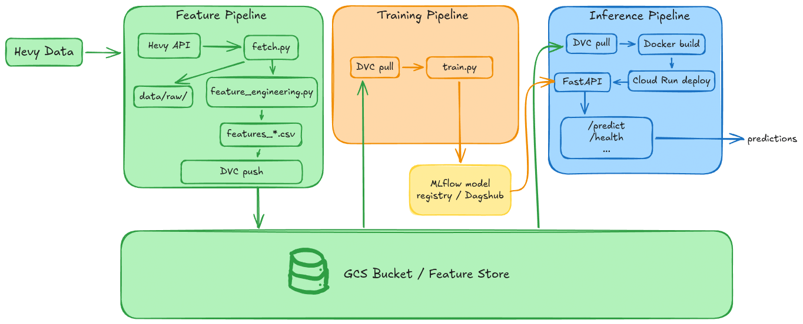

# hevy-fti-predictor

> *your gym data, but make it machine learning*

A fully automated MLOps pipeline that pulls your workout history from [Hevy](https://hevy.com), engineers features, and trains models to predict future training loads — all versioned, containerized, and running on CI/CD.

**Stack:** Python · FastAPI · DVC · MLflow (DagsHub) · Docker · Cloud Run · GitHub Actions · GCS

## Pipeline



The project follows the FTI (Feature / Training / Inference) architecture for an end-to-end "Live" ML system. Each pipeline is decoupled and automated via GitHub Actions.

## Quickstart

```bash
# Install tools
mise install

# Install Python dependencies
uv sync

# Authenticate with GCP
gcloud auth login
gcloud auth application-default login

# Pull data from DVC remote
dvc pull

# Set your Hevy API key
echo "HEVY_API_KEY=<your_key>" > .env

# Run the pipelines
uv run src/feature_pipeline/fetch.py
uv run src/feature_pipeline/feature_engineering.py
uv run src/training_pipeline/train.py
```

## Architecture

### Feature Pipeline
Scheduled daily via GitHub Actions. Fetches workouts from the Hevy API, computes 16 engineered features (rolling volume per muscle group, days since last exercise, volume trends, session history, global workload, workout frequency, temporal features), and stores the result as versioned CSV files on GCS via [DVC](https://dvc.org/).

### Training Pipeline
Triggered after the feature pipeline. Reads the latest features, trains a regression model to predict exercise volume, evaluates performance, and registers the best model to the MLflow Model Registry on DagsHub.

### Inference Pipeline
Runs on-demand. A FastAPI server loads the registered model and pre-computed feature store to serve predictions via a REST API. Deployed on Google Cloud Run.

→ [Inference deployment guide](docs/inference.md) · [API reference](docs/api.md) · [GCS setup](docs/gcs.md)

## Environment Variables

Copy the template and fill in your keys:

```bash
cp example.env .env
```

### Shared (needed in both `.env` and GitHub Actions)

| Variable | GitHub | Description |
|----------|--------|-------------|
| `HEVY_API_KEY` | [Secret](https://docs.github.com/en/actions/security-for-github-actions/security-guides/using-secrets-in-github-actions) | Hevy API key |
| `DAGSHUB_TOKEN` | Secret | DagsHub access token ([get one here](https://dagshub.com/user/settings/tokens)) |
| `DAGSHUB_REPO_OWNER` | [Variable](https://docs.github.com/en/actions/security-for-github-actions/security-guides/using-secrets-in-github-actions#using-variables) | Your DagsHub username |
| `DAGSHUB_REPO_NAME` | Variable | Repository name on DagsHub |

### CI/CD only (GitHub repository secrets)

| Secret | Description |
|--------|-------------|
| `GCP_PROJECT_ID` | GCP project ID |
| `GCP_WORKLOAD_IDENTITY_PROVIDER` | WIF provider resource name |
| `GCP_SERVICE_ACCOUNT` | SA email (`github-actions@<PROJECT>.iam.gserviceaccount.com`) |

See [docs/gcs.md](docs/gcs.md) for GCP setup instructions.

## CI/CD

| Workflow | File | Trigger | What it does |
|----------|------|---------|--------------|
| **Update Data** | `.github/workflows/update-data.yml` | Daily at 06:00 UTC | Fetches Hevy workouts, computes features, pushes to GCS via DVC |
| **Train Model** | `.github/workflows/train.yml` | After Update Data succeeds | Pulls data, builds Docker image, runs training, logs to DagsHub MLflow |
| **Deploy Inference** | `.github/workflows/deploy.yml` | After Train Model succeeds | Pulls feature store, builds inference image, deploys to Cloud Run |

## Documentation

| Document | Content |
|----------|---------|
| [Inference Guide](docs/inference.md) | Deployment, architecture, local testing, performance |
| [API Reference](docs/api.md) | Endpoints, request/response schemas, curl examples |
| [GCS Setup](docs/gcs.md) | Google Cloud Storage and Workload Identity Federation |
| [Hevy API](docs/hevy_api.md) | Upstream API reference (authentication, endpoints, data model) |

## Tools

| Tool | Purpose |
|------|---------|
| [uv](https://docs.astral.sh/uv/) | Python environment & dependencies |
| [mise](https://mise.jdx.dev/) | Global tool versioning (gcloud, pipx) |
| [DVC](https://dvc.org/) | Data version control |
| [pipx](https://pipx.pypa.io/) | Isolated install for `dvc[gs]` |
| [gcloud](https://cloud.google.com/sdk/gcloud) | GCS authentication |
